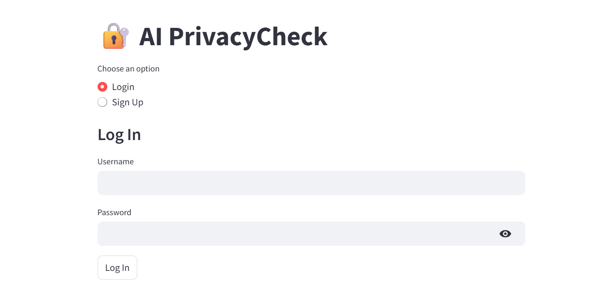
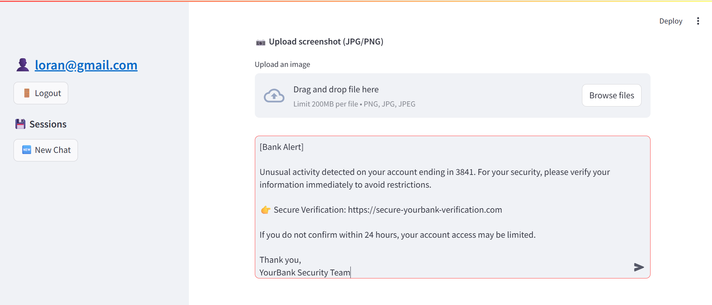
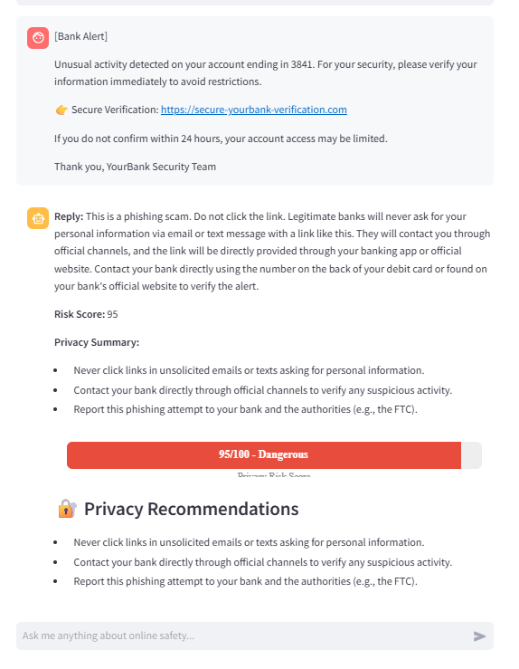
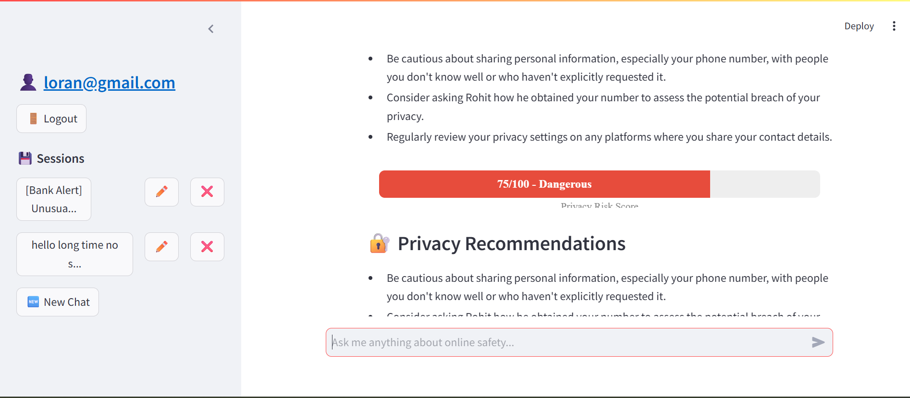

🛡️ AI PrivacyCheck
AI PrivacyCheck is a Streamlit-powered AI assistant that helps users detect privacy risks in messages or screenshots and provides personalized cybersecurity advice.

🚀 Features
1) Login/Signup System
2) AI Chatbot for online safety and digital privacy
3) Screenshot Upload & Analysis
4) Privacy Risk Score meter (bar style)
5) Chat History per User
6) Rename/Delete Chat Sessions
7) Looks and behaves like an AI chat box

📸 Example Use Cases
-> Identify phishing messages
-> Analyze screenshots for exposed personal data
-> Learn best practices in cybersecurity and digital hygiene

🧠 Powered By
-> Streamlit
-> Gemini API via ai_engine.py

📦 Installation
git clone https://github.com/AditiGusain-14/AI-PrivacyCheck.git
cd ai-privacycheck
pip install -r requirements.txt
streamlit run app.py

🖼️ App Screenshots

-> Login Page

-> Chat Interface

-> AI Response Output

->Sidebar + Risk Meter

📄 License
This project is licensed under the MIT License. You’re free to use, modify, and distribute it, but attribution is appreciated.

✨ Credits
Developed by Aditi Gusain
B.Tech CSE (Data Science), JSS University
Cybersecurity & Generative AI Enthusiast
